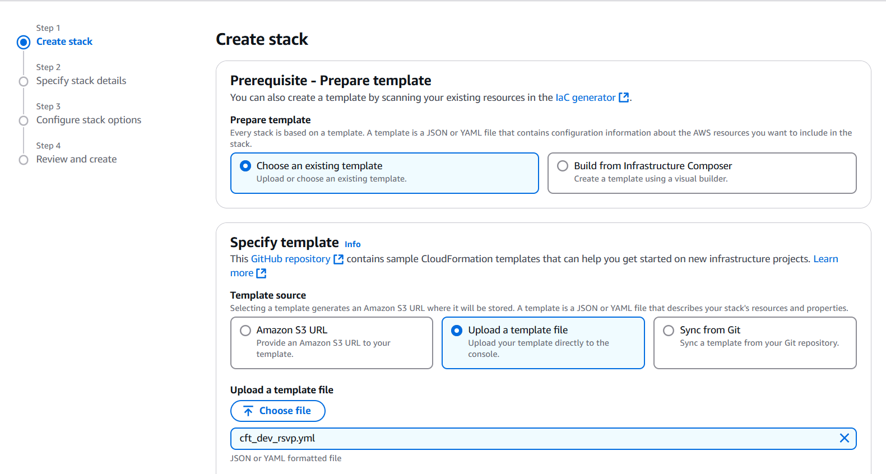
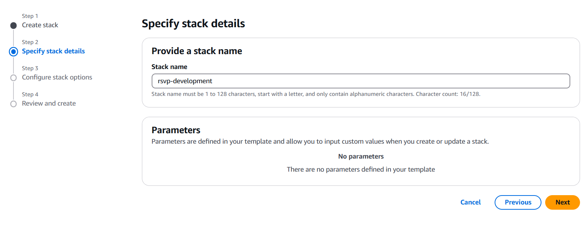

# Steps to Upload CloudFormation Template and Set Up AWS Cloud for RSVP Project

#### Prerequisite

- Make sure you have your own AWS account. If not sign up [here](https://aws.amazon.com/free)
- Download the `cft_dev_rsvp.yml` file from [here](../apps/server/templates/)

---

#### Step 1

- Visit [AWS CloudFormation service](https://ap-southeast-2.console.aws.amazon.com/cloudformation/home?region=ap-southeast-2#/getting-started).
- Click on the `Create Stack` button.
- On the Create Stack page, select `Upload a template file`.
- Choose the `cft_dev_rsvp.yml` file you downloaded earlier, and click on `Next`.

---

#### Step 2

- On the `Specify Stack Details` page, provide a `Stack Name`, then click on `Next`.

---

#### Step 3

- On the `Configure stack options` page, leave everything as default, check the checkbox inside the `Capabilities` section & then click on `Submit`.
- On `Review and create` page. Click on Submit to Start Stack Creation Process.

---

#### Step 4

- Wait until the stack creation status becomes `CREATE_COMPLETE`.
- Now go to the `Output` section of the stack, and you can find `AWS_ACCESS_KEY, AWS_SECRET_KEY, AWS_BUCKET_NAME, AWS_REGION` of the environmental variables. Take these values and paste in your `.env` file

##### 🎉 Your AWS Setup process is now complete.
