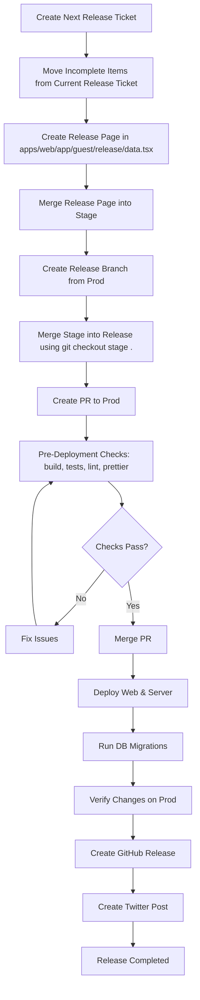

# Release Process Documentation



## Overview

This document outlines the complete release process for the RSVP project, from planning to deployment and announcement.

---

## Step 1: Create Next Release Ticket and Organize Items

### Purpose

Track all items for the upcoming release and ensure proper cleanup of the previous release ticket.

### Actions

1. **Create a new release ticket** using the naming convention: `Release v0.x.x`
   - Example: `Release v0.6.0`

2. **Review the current release ticket**
   - Identify items that are **NOT completed** in the current release
   - Move these incomplete items to the new release ticket list items and change sub-issue parents.

3. **Clean up the current release ticket**
   - Verify the list items count matches the number of completed sub-issues
   - Ensure all list items are accurate and reflect completed work

---

## Step 2: Create /release page with new release data

### Purpose

Update the release page with user-facing changes.

### Actions

1. **Open the file**: `apps/web/app/(guest)/release/data.tsx`

2. **Add a new release entry** at the top of the `changelogs` array with:
   - `releaseDate`: Current date
   - `version`: Release version (e.g., `'0.6.0'`)
   - `contributors`: Array of GitHub usernames who contributed
   - `sections`: Array of sections with user-friendly descriptions

3. **Structure sections** as:
   - **Features**: New capabilities
   - **Enhancements**: Improvements to existing features
   - **Bug Fixes**: Issues resolved

4. **Write descriptions**
   - Use non-technical, user-friendly language
   - Focus on **what** changed, not **how** it was implemented
   - Keep summaries concise and clear

5. **Create a PR** targeting `stage` branch
6. **Get it reviewed and merged** into `stage`

---

## Step 3: Create Release Branch and PR to Production

### Purpose

Prepare the codebase for production deployment with all changes from `stage`.

### Actions

1. **Create a new branch from `prod`**:

   ```bash
   git checkout prod
   git pull origin prod
   git checkout -b release-0.x.x
   ```

2. **Merge `stage` into the release branch**:

   ```bash
   git checkout stage .
   git add .
   git commit -m "merge stage for release v0.x.x"
   ```

   > **Note**: Using `git checkout stage . ` ensures you get all files from `stage`, effectively replacing the working directory with `stage`'s content.

3. **Push the release branch**:

   ```bash
   git push origin release-0.x.x
   ```

4. **Create a Pull Request**:
   - **From**: `release-0.x.x`
   - **To**: `prod`
   - **Title**: `Release v0.x.x`

---

## Step 4: Pre-Deployment Checks

### Purpose

Ensure code quality and prevent deployment issues.

### Local Checks (Before Merging)

Run the following commands locally in both directories (`/web` and `/server`):

```bash
# Build the project
pnpm build

# Run tests
pnpm test

# Run linting
pnpm lint

# Format code
pnpm check
```

### GitHub Actions Checks

Once the PR is created, GitHub Actions will automatically run:

- Build verification
- Test suite
- Linting checks
- Prettier formatting checks

All checks **must pass** before creating the PR.

---

## Step 5: Deploy and Verify

### Purpose

Deploy the release to production and ensure everything works as expected.

### Actions

1. **Merge the PR** to `prod` once all checks pass

2. **Deploy the web application**
   - Trigger deployment via your deployment platform (Railway)

3. **Deploy the server application**
   - Trigger backend deployment

4. **Run database migrations**
   - Ensure all schema changes are applied
   - Verify migration success in logs

5. **Verify all changes on production**
   - Go through each item in the release ticket
   - Test functionality manually on production environment
   - Confirm no regressions or issues

### Verification Checklist

- [ ] Web application deployed successfully
- [ ] Server deployed successfully
- [ ] Database migrations completed
- [ ] All release ticket items verified
- [ ] No console errors on production
- [ ] Key user flows tested

---

## Step 6: Create GitHub Release Page

### Purpose

Provide a technical changelog for developers and stakeholders.

### Actions

1. **Navigate to**: [Releases Page](https://github.com/TeamShiksha/rsvp/releases)

2. **Click** "Draft a new release"

3. **Fill in the details**:
   - **Tag**: `0.x.x` (e.g., `0.6.0`)
   - **Release title**: `0.x.x`
   - **Description**: Follow the existing format from previous releases

4. **Structure the description**:

   ```markdown
   ## What's Changed

   ### Features

   - Feature description by @contributor in #PR_NUMBER

   ### Enhancements

   - Enhancement description by @contributor in #PR_NUMBER

   ### Bug Fixes

   - Bug fix description by @contributor in #PR_NUMBER

   ## New Contributors

   - @newcontributor made their first contribution in #PR_NUMBER

   **Full Changelog**: https://github.com/TeamShiksha/rsvp/compare/0.x-1.0... 0.x. 0
   ```

5. **Review the format** from previous releases:
   - [v0.5.0](https://github.com/TeamShiksha/rsvp/releases/tag/0.5.0)
   - [v0.4.0](https://github.com/TeamShiksha/rsvp/releases/tag/0.4.0)
   - [v0.3.0](https://github.com/TeamShiksha/rsvp/releases/tag/0.3.0)

6. **Include**:
   - All PRs merged since last release
   - Technical details (API changes, database changes, etc.)
   - Breaking changes (if any)
   - New contributors with their first PR

7. **Publish the release**

---

## Step 7: Create Twitter Post

### Purpose

Announce the release to the community and users.

### Actions

1. **Review the GitHub release page** for key highlights

2. **Draft a Twitter post** that includes:
   - Release version
   - Top 3-5 features/improvements
   - Link to the release page
   - Relevant hashtags

3. **Options for drafting**:
   - Use AI tools

4. **Post the announcement** on Twitter

---

## Quick Reference Checklist

Use this checklist for each release:

- [ ] Create release ticket `Release v0.x.x`
- [ ] Move incomplete items from previous release
- [ ] Verify previous release ticket accuracy
- [ ] Add release entry to `apps/web/app/(guest)/release/data.tsx`
- [ ] Create PR to `stage` and merge
- [ ] Create branch `release-0.x.x` from `prod`
- [ ] Merge `stage` into release branch using `git checkout stage .`
- [ ] Create PR from `release-0.x.x` to `prod`
- [ ] Run local checks: build, test, lint, prettier
- [ ] Wait for GitHub Actions to pass
- [ ] Merge PR to `prod`
- [ ] Deploy web application
- [ ] Deploy server application
- [ ] Run database migrations
- [ ] Verify all changes on production
- [ ] Create GitHub release page (technical)
- [ ] Create and publish Twitter post

---

## Document History

| Version | Date       | Changes               | Author         |
| ------- | ---------- | --------------------- | -------------- |
| 1.0     | 2025-12-28 | Initial documentation | azeemuddinaziz |
